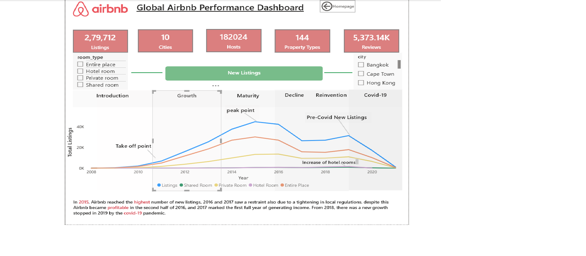
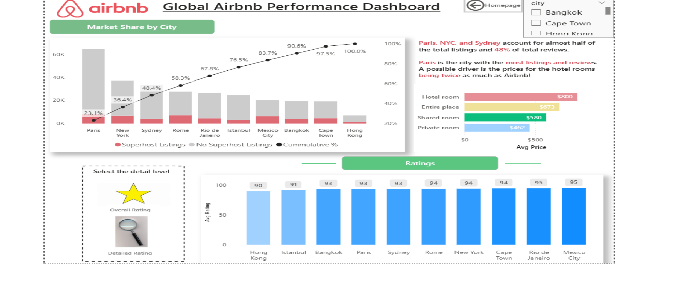
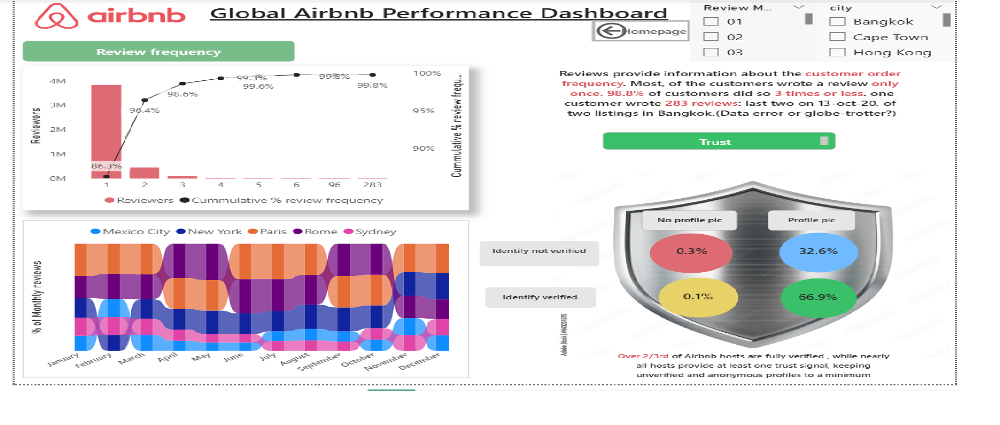
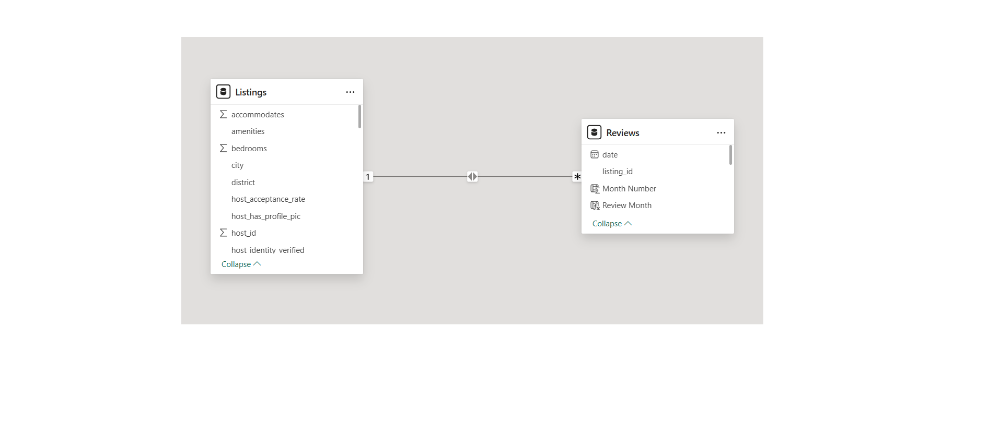

# Airbnb_Performance_Dashboard

# Overview
 ---
This Power BI dashboard provides a comprehensive analysis of Airbnb’s global performance. It explores listings, pricing, ratings, and reviews across major cities, with interactive features that make insights actionable and improve decision‑making for business strategy.
# Project Assets
---
- **Dashboard PBIX FILE:**  [Download here](https://drive.google.com/file/d/1Wl9Qn6jkzHEIsc8z0AJZxr3a9hb9xplC/view?usp=drive_link)
- **Dataset used:**  [Listings.csv](https://drive.google.com/file/d/1pCw6E4LKmF6BiTlmSeakvIUBVBv_lFYb/view?usp=drive_link) and [Reviews.csv](https://drive.google.com/file/d/1tyfTHNgB9YJ6DmZpGUuqXxJNQdmf0EL_/view?usp=drive_link)
- **Dataset source:** [Maven Analytics - Airbnb Listings and Reviews ](https://mavenanalytics.io/data-playground/airbnb-listings-reviews)
# Dashboard Pages
  ---
- **Homepage:**   Central landing page with Page Navigator.  
- **Overview:**  Market share by city, superhost vs non‑superhost distribution, headline insights.  
- **Ratings:**   Ratings by city, Avg Price comparison, custom tooltip with Avg Price 
- **Reviews:**   Review distribution and cumulative trends highlighting host engagement.  
- **Tooltip_rating:**   Compact KPI cards (Avg Price, Total Listings) designed for hover interactions.  

# Visual Insights
---
- **Overview**
  
- **Rating**
  
- **Reviews**
  
- **Model Relationship**
  

# Features
  ---
- **Custom Tooltips:** Contextual KPIs (Avg Price displayed instantly on hover.  
- **Bookmarks:** In Ratings page, if user selected overall rating then column chart will display and if the user selected the detailed rating then matrix chart will display.  
- **Page Navigator:** Centralized navigation from Index page for seamless exploration.  
- **Slicers:** Dynamic filtering by city, month number ,room type and other dimensions.  
- **Consistent Design:** Professional layout with standardized buttons and ovals.
- **Measures created:** total listings , avg price , total reviews, reviews per reviewer , cummulative frequency etc.

# Insights 
- **City Dominance:** **Paris, NYC , and Sydney** account for more than half of listings and **~48 of reviews**.  
- **Superhost Advantage:** Superhost listings correlate with higher ratings and stronger review activity.  
- **Pricing Variation:** Avg Price differs significantly across cities, guiding pricing optimization strategies.  
- **Review Growth:** Reviews highlight increasing trust and engagement with verified hosts.  

# Business Impact:  
  This dashboard enables Airbnb to:  
- Identify high‑performing markets for targeted strategy.  
- Optimize pricing across diverse cities.  
- Strengthen host engagement by promoting Superhost practices.  
- Build customer trust through review analysis.

# Future Enhancements
- Predictive Analytics: Forecast demand and pricing trends using historical data.  
- Live Data Integration: Connect to Airbnb’s API for real‑time updates.  
- Sentiment Analysis: Apply NLP to reviews for deeper satisfaction insights.  
- Geospatial Mapping: Interactive maps to visualize listings and performance by location.  
- Automated Alerts: Notifications when KPIs cross thresholds (e.g., Avg Price spikes).  

# Important findings per pages
---
- **Overview page:** **In 2015**, Airbnb reached the **highest number** of new listings. 2016 and 2017 saw a restraint also due to a tightening in local
                 regulations. Despite this, Airbnb became profitable in the second half of 2016, and 2017 marked the first full year of generating income.From 
                 2018, there was a new growth stopped in 2019 by the covid-19 pandemic.

- **Ratings page:** **Paris, NYC and Sydney** account for almost half of the total listings and **48% of total reviews**.
                **Paris**** is the city with the most listings and reviews. A possible driver is the prices for hotel rooms being twice as much as Airbnb.
                Mexico City and Rio** are the overall best-rated cities, **Hk and Instanbul** the worst ones.Cleanliness and value for money ratio are the two matrics                    generally scoring the lowest

- **Reviews page:** Reviews provide information about the customer order frequency. Most of the customers wrote a review only once. **98.8%** of customers
                 did so 3 times or less. one customer wrote **283 reviews**: last two on 13th-oct-20 , of two listings in Bangkok.(data error or globe trotter?)
  
# Conclusion
---
The Airbnb Performance Dashboard is more than a visualization tool—it is a strategic lens into global market dynamics. By combining interactive features such as slicers, bookmarks, and tooltips with carefully designed DAX measures, the dashboard transforms raw Airbnb data into actionable intelligence.  
From uncovering city‑level market share to comparing hotel and Airbnb pricing, and drilling down into detailed rating dimensions, the dashboard empowers stakeholders to identify opportunities, benchmark performance, and make informed business decisions.  
This project demonstrates how thoughtful design and interactivity in Power BI can bridge the gap between data and strategy, delivering insights that are not only descriptive but also prescriptive for future growth.
